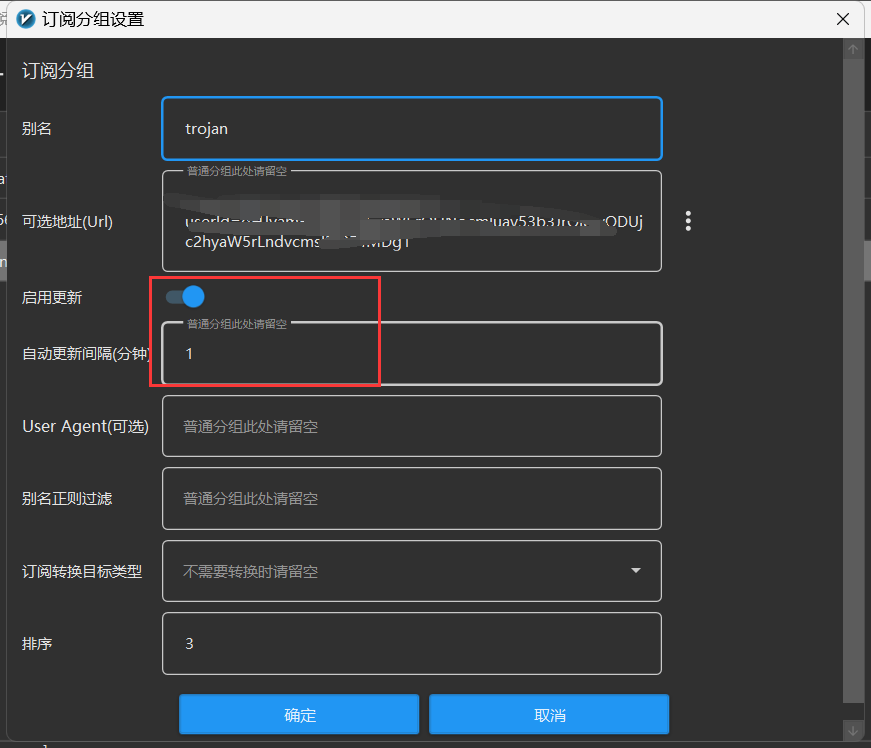

> 本项目是在https://github.com/Jrohy/trojan 基础之上做的
# 搭建trojan服务端流程注意点：
1. 用cloudflare warp分流以访问chatgpt，参考链接： https://p3terx.com/archives/cloudflare-warp-configuration-script.html 。

2. 为了防止gfw屏蔽端口，使用动态端口的办法：

   > 由于长时间使用同一个端口会被gfw屏蔽，故需要更换端口，但是手动更换端口太麻烦，故采用都动态端口的方法。
   >
   > 原理：[V2RayN](https://github.com/2dust/v2rayN)定期地访问一个应用来获取最新的trojan地址（主要是端口变化），然后用拿到的地址去访问trojan，这个过程中由于trojan端口不是固定的，所以gfw很难针断端口去屏蔽。

   1. V2RayN开启动态更新服务器列表，拿到10000-50000之间的任意端口。

      1. 需要一个应用来负责给V2RayN返回动态端口（参考本项目代码）
   
      2. V2RayN操作如下
          
   
           > 其中填的Url： http://应用的ip:port?userId=xxxxx，其中userId值为trojan用户订阅链接base64编码之后的值。

   2. 服务端转发（10000-50000转发到trojan运行端口8085），这样V2RayN访问10000-50000端口的时候会被转发到8085端口以被trojan接收。

      ```sh
      iptables -t nat -A PREROUTING -p tcp --dport 10000:50000 -j REDIRECT --to-ports 8085
      ```
